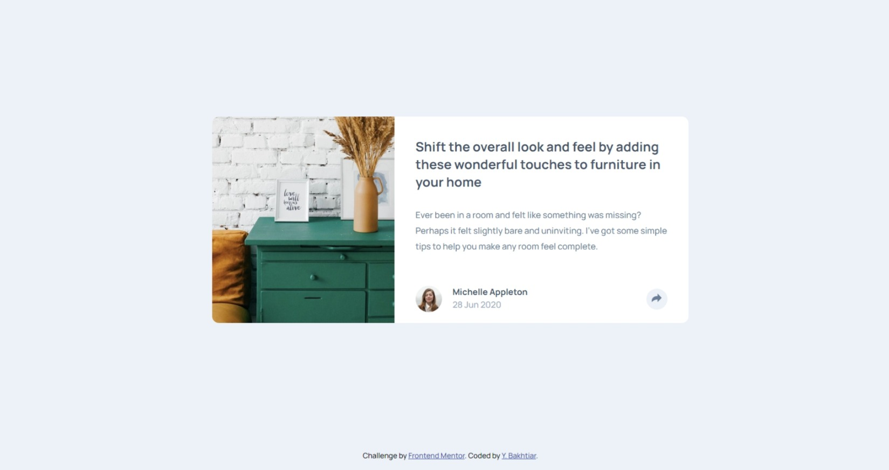

# Frontend Mentor - Article preview component solution

This is a solution to the [Article preview component challenge on Frontend Mentor](https://www.frontendmentor.io/challenges/article-preview-component-dYBN_pYFT). Frontend Mentor challenges help you improve your coding skills by building realistic projects. 

## Table of contents

- [Frontend Mentor - Article preview component solution](#frontend-mentor---article-preview-component-solution)
  - [Table of contents](#table-of-contents)
  - [Overview](#overview)
    - [The challenge](#the-challenge)
    - [Screenshot](#screenshot)
    - [Links](#links)
    - [Built with](#built-with)
  - [Author](#author)

## Overview

### The challenge

Users should be able to:

- View the optimal layout for the component depending on their device's screen size
- See the social media share links when they click the share icon

### Screenshot

### Links

- Solution URL: [Here](https://www.frontendmentor.io/solutions/htmlcssjs-article-preview-component-_67PG-DqWo)
- Live Site URL: [Github Page](https://b4khtiar.github.io/article-preview-component-yb/)

### Built with

- HTML5
- CSS custom properties
- Flexbox
- Mobile-first workflow
- Stylus preprocessor

## Author

- Github - [b4khtiar](https://github.com/b4khtiar)
- Frontend Mentor - [@b4khtiar](https://www.frontendmentor.io/profile/b4khtiar)
